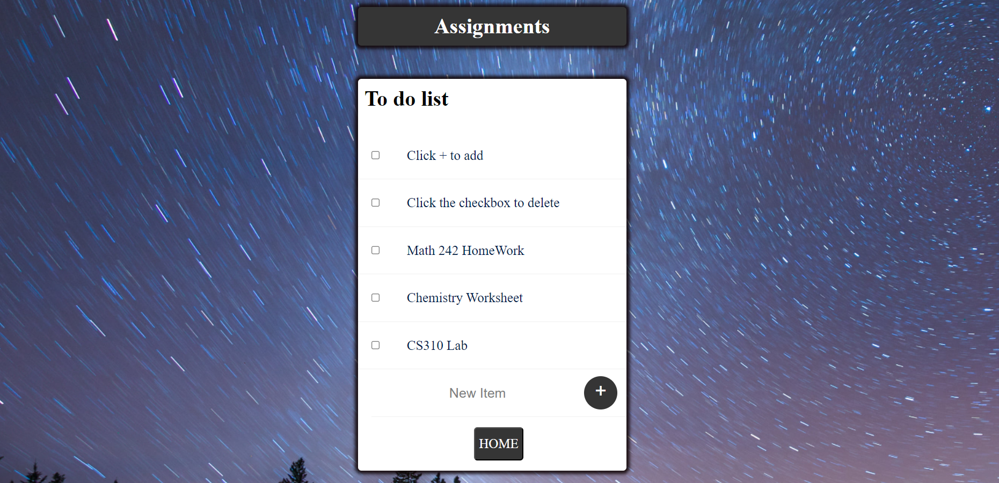

# To-Do List Website

![To-Do List Website]

Welcome to the To-Do List Website repository! This is a simple web application built using Node.js, JavaScript, EJS, CSS, and HTML, designed to help you organize and manage your tasks effectively. The app allows you to create, edit, and mark tasks as completed, helping you stay on top of your daily responsibilities.

## Features

- **Create Tasks:** Add new tasks to your to-do list with ease. Simply type in your task and hit the "Add" button.

- **Mark Completed:** When you've completed a task, you can mark it as done by clicking the checkbox next to the task description.

## Getting Started

To run the To-Do List Website locally on your machine, follow these steps:

### Prerequisites

- Node.js and npm (Node Package Manager) should be installed on your computer.

### Installation

1. Clone this repository to your local machine using:

